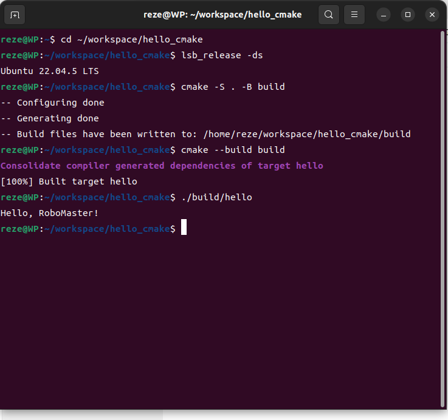

# Hello CMake

## 项目简介

使用 CMake 构建的 C++ 程序，运行后输出 `Hello, RoboMaster!`。

## 环境

- Ubuntu 22.04.5 LTS
- CMake 3.22.1
- GCC 11.4.0

安装命令：

```bash
sudo apt update
sudo apt upgrade -y
sudo apt install -y build-essential cmake git
```

验证：

```bash
lsb_release -a
g++ --version
cmake --version
git --version
```

## 目录结构

```
hello_cmake/
├── CMakeLists.txt   # 构建规则
├── README.md        # 说明文档
├── .gitignore       # Git 忽略清单
├── src/             # 源代码目录
│   └── main.cpp
├── images/          # README 引用的截图
│   └── success.png
└── build/           # CMake 自动生成的构建目录，
```

- `src/`：存放自己编写的源代码，与构建产物分开，保持源目录干净。
- `images/`：存放 README 中引用的图片，展示程序在 Ubuntu 下已成功构建并运行。
- `build/`：CMake 自动生成的构建目录，可随时删除重建，不提交到 Git。

## 构建步骤

在仓库根目录下执行：

```bash
cmake -S . -B build
cmake --build build
./build/hello
```

## 运行结果

终端输出：

```
Hello, RoboMaster!
```

运行成功截图：



## 作者和日期

盛明伟 2253211152  完成日期：2026年9月17日
